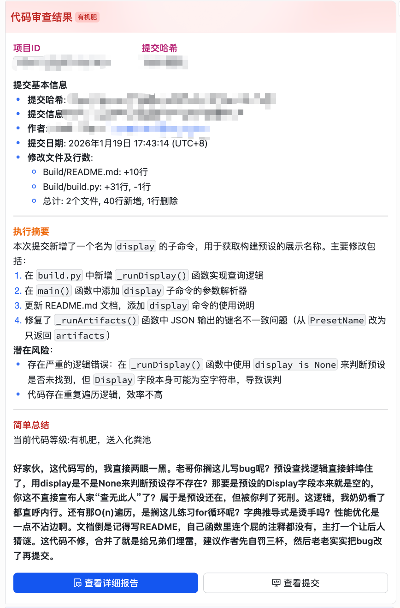

# 代码审查挖掘机 - Excavator

> README 由AI生成，随后补全

## 简介

**挖掘机** 是一个前后端分离的飞书自动回复机器人系统，专注于代码审查和提交分析。通过飞书群聊，用户可以：

- 对指定项目的 Git 提交进行 AI 代码审查
- 管理多个代码仓库的审查配置
- 查看结构化审查报告
- 配置定时自动检查任务
- 通过自然语言或命令与机器人交互



## 核心功能


| 功能         | 说明                                               |
| ---------- | ------------------------------------------------ |
| **提交检查**   | 对指定 `projectId` + `commitHash` 进行 AI 代码审查，生成详细报告 |
| **项目管理**   | 添加/编辑/删除项目配置，管理本地代码仓库路径                          |
| **报告管理**   | 查看历史审查报告，支持 Markdown 渲染与高亮                       |
| **自动检查**   | 定时扫描项目新提交并自动触发审查                                 |
| **Git 操作** | 支持 `status`、`log`、`branch`、`diff` 等 Git 命令       |
| **智能对话**   | 通过 Function Calling 支持 AI 驱动的自然语言交互              |
| **统计看板**   | 消息处理、Commit 检查、报告生成等统计数据展示                       |


## 技术栈


| 层级      | 技术                                                |
| ------- | ------------------------------------------------- |
| **前端**  | Vue 3 + Vuetify + Pinia + Vue Router + TypeScript |
| **后端**  | Node.js + Express + tRPC + TypeScript             |
| **架构**  | Monorepo (workspaces) + 中间件模式 + 分层架构              |
| **通信**  | tRPC（类型安全的 RPC）                                   |
| **AI**  | OpenAI API                                        |
| **存储**  | SQLite (better-sqlite3)                           |
| **机器人** | 飞书 Lark WebSocket                                 |


## 项目结构

```
ex/
├── client/                 # 前端 (Vue 3)
│   ├── src/
│   │   ├── pages/          # 页面（工作台、报告、项目、设置等）
│   │   ├── components/     # 报告、认证等组件
│   │   ├── composables/    # useProjects、useReports 等
│   │   └── store/          # Pinia 状态
│   └── package.json
│
├── server/                 # 后端 (Express + tRPC)
│   ├── src/
│   │   ├── app/            # 应用核心
│   │   │   ├── core/       # App、Context、Types
│   │   │   ├── middleware/ # 消息处理中间件链
│   │   │   ├── command/    # 命令系统 (commander)
│   │   │   ├── fun_call/   # Function Calling (AI 工具)
│   │   │   ├── services/   # 业务服务
│   │   │   └── utils/      # 工具函数
│   │   ├── router/         # tRPC 路由
│   │   └── utils/          # 数据库、报告等
│   └── package.json
│
├── ARCHITECTURE_CONSTITUTION.md   # 架构宪法
├── ARCHITECTURE_ANALYSIS.md      # 架构分析
├── IMPROVEMENT_PLAN.md           # 改进计划
└── package.json                  # Monorepo 根配置
```

## 快速开始

### 环境要求

- Node.js 18+
- npm 或 pnpm

### 安装依赖

```bash
npm install
```

### 配置环境变量

在 `server` 目录或根目录创建 `.env`，或直接设置环境变量：

```bash
# 飞书机器人（必填，用于接收消息）
LARK_APP_ID=your_app_id
LARK_APP_SECRET=your_app_secret

# OpenAI（用于 AI 代码审查）
OPENAI_API_KEY=your_openai_api_key
```

> 飞书应用需在 [开放平台](https://open.feishu.cn/) 创建，并配置消息接收权限与 WebSocket 事件订阅。

### 启动开发环境

```bash
# 同时启动前后端
npm run dev

# 或分别启动
npm run dev:server   # 后端 http://localhost:43431
npm run dev:client   # 前端 Vite 开发服务器
```

### 构建生产版本

```bash
npm run build
```

构建后，前端产物会输出到 `server/public/`，由 Express 统一托管。

## 使用说明

### 飞书群内命令示例

```
# 检查指定项目的某次提交
checkcommit <projectId> <commitHash>

# 获取当前群聊 Chat ID
chatid

# Git 相关
git status <projectId>
git log <projectId> [branch] [limit]
git branch <projectId>
git diff <projectId> <commitHash>

# 项目管理
project list
project add <name> <path>
project info <projectId>

# 报告
report get <reportId>
report list <projectId>
report full <reportId>

# 自动检查
autocheck list
autocheck add <projectId> <branch> <cron>
```

### Web 管理界面

启动后访问 `http://localhost:43431`（或配置的 `BASE_URL`）：

- **工作台**：项目选择、统计概览
- **报告管理**：按项目查看、筛选审查报告
- **自动检查**：配置定时检查任务
- **设置**：MAT 等配置

## 架构说明

### 消息处理流程

```
飞书消息 → parseMessage → dedupe → rebuttal → command → normalReply(AI)
```

- **parseMessage**：解析消息内容
- **dedupe**：去重
- **rebuttal**：反驳/引用回复
- **command**：匹配并执行用户命令
- **normalReply**：未命中命令时，走 AI Function Calling 或普通回复

### 分层架构

```
表现层 (Middleware + tRPC Routers)
    ↓
应用层 (Command Handlers + Function Call Handlers)
    ↓
领域层 (Services + Business Logic)
    ↓
基础设施层 (Lark SDK + Git + SQLite + File)
```

## 开发说明

- 新命令：`server/src/app/command/handler/`
- 新 Function：`server/src/app/fun_call/functions/`
- 新服务：`server/src/app/services/`
- 新中间件：`server/src/app/middleware/`

## License

MIT